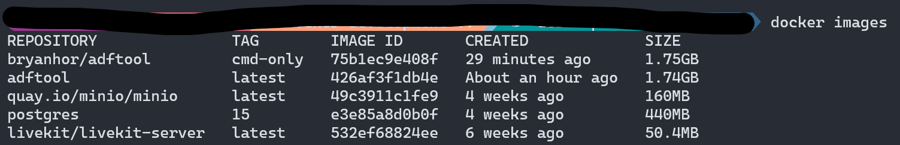
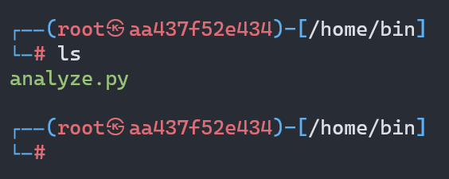
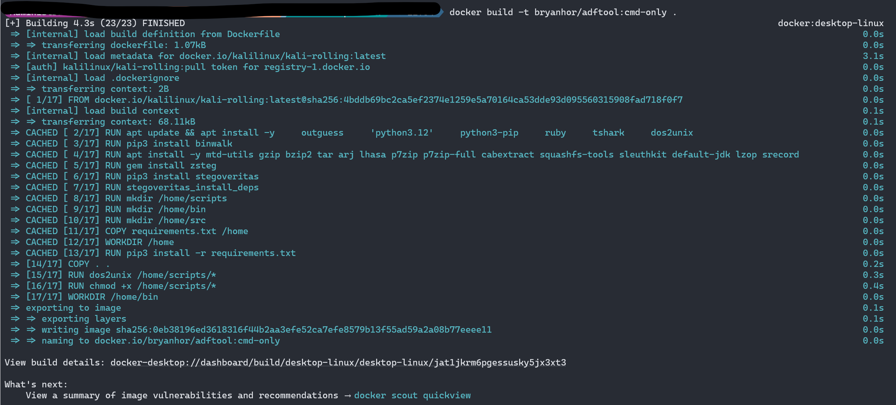
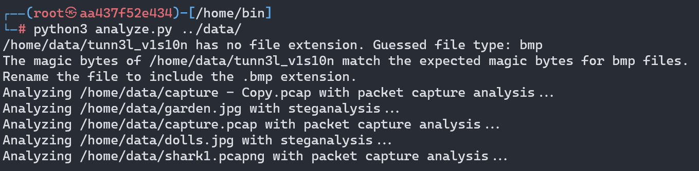
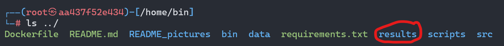

# ADFTool

This is a Final Year Project for APD3F2311CS(CYB). This tool is mainly developed from my own needs when tackling Digital Forensics CTF challenges. The main aim for this tool is to have all the Digital Forensics-related tools in one 'toolbox'. The tool is aimed to be offline/desktop-based, however, due to certain limitations, it will be running at localhost in a browser instead of a standalone desktop application.

## Tools to include

### Steganalysis tools

- [x] zsteg
- [x] stegoveritas
- [x] outguess
- [x] binwalk

### Network Packet analysis tools

- [x] tshark

### Memory analysis

- [ ] Volatility
- [ ] The Sleuth Kit

## User Interface

This tool will include a Graphical User Interface (GUI), mainly to satisfy my FYP requirement. The GUI is to be built using Python Flask. However, if the user prefers using the command line to interact with the tool, they can do so too.

### TODO

None for now

## USAGE

To use ADFTool, you can either clone the GitHub repo and then execute the installation scripts included or build the Docker images manually. Both options will be explored below.

Please note the prerequisite below.

**Prerequisites: Docker is installed in your machine. Refer to the [Docker Installation page](https://docs.docker.com/engine/install/) on how to install Docker in your machine.**

### Cloning the GitHub repo

To obtain the docker image via GitHub, you can run the command below to clone the repository to your current working directory

`git clone https://github.com/BryanHJH/adftool.git`

### Using the installation scripts

1. To use CLI mode: Run the `INSTALL_CLI.bat` if you are using the Windows operating system or the `INSTALL_CLI.sh` if you are using UNIX-like operating systems
2. To use GUI mode: Run the `INSTALL.bat` if you are using the Windows operating system or the `INSTALL.sh` if you are using UNIX-like operating systems

Notes for using the CLI installation scripts:

The files to be analyzed must be provided at the beginning of the container building process. If the installation script is executed, the script will ask for 2 folder paths, the first path is where you store the files to be analysed and the second is where the results should be stored.

### Building ADFTool manually

Once the GitHub repository has been cloned to your machine, you can run build the docker container by using the commands below:

```bash
cd ADFTool/
```

#### Building CLI mode

```docker
docker build -t bryanhor/adftool:latest .
docker run -it -v /your/local/path/to/files_to_analyse:/home/data -v /your/local/path/for/results/:/home/results bryanhor/adftool:latest bash
```

There are 2 `-v` flags because the first one is to load the folder that has the files that you wish to analyze. This folder is bound to the `/home/data` in the docker container. The second `-v` flag is to bind the results generated in the docker container to one of your local folders.

Refer to [CLI USAGE](#cli-usage) for a more detailed usage guide in CLI mode.

#### Building GUI mode

```docker
docker build -t bryanhor/adftool:latest .
docker run -d -p 5001:5001 bryanhor/adftool:latest
```

Refer to [GUI USAGE](#gui-usage) for a more detailed usage guide in GUI mode.

### CLI Usage

Once you executed the INSTALL_CLI scripts, you will be brought to a Linux Bash instance as the `root` user. You will be in the `/home` directory when you first land in the Linux Bash instance.

ADFTool comes with several commands that are built-in that allows you to perform analysis on your files, as shown below:

1. `full_analyze` -- Performs magic byte analysis, steganalysis and network packet capture analysis
2. `image_analyze` -- Performs only stegnalaysis
3. `pcap_analyze` -- Performs only network packet capture analysis

All commands above takes 2 arguments, a file path and `-v` or `--verbose`. The file path can either point towards a single file or an entire directory. If a single file is provided.

The files to be analysed will be stored in `/home/data`, the specific files are obtained from the first folder path that you provided when using the CLI installation script.
The results for all analysis will be stored in `/home/results`. You can also find the results in the second folder path (your local machine) that you provided when using the CLI installation script.

### GUI Usage

Once the correct installation script or commands above have been executed, you can go to your browser and type in `http://localhost:5001/` to access the GUI.

Once inside the GUI, it will like the image below:


You can upload a single file by clicking on the "Browse" button and selecting the file you want to upload. Currently, the GUI for ADFTool can only accept one file each time. 

Once uploaded, the file will go through magic byte analysis and the output will be displayed as text on the same page, as shown in the picture below:


If the uploaded file passes the magic byte analysis, it will be further analysed depending on the file type. Currently only image and network packet captures will be further analysed. The picture below shows an example of a successfuly analysis and the page containing all the results.


Once you're done and happy with the analysis, you can choose to download all the files or specific files. If you only want the specific files, you can just click on the file name that is displayed at the top of the In Depth results page shown in the picture above. 

Once you are satisfied and want to exit from the GUI, you can just close the browser.

## REMOVAL

To remove the docker container, you can use the following steps:

### Step1

This step is to remove the docker container that was being used. This step is necessary if the `--rm` was not included in the `docker run` command above.

```bash
docker ps -a # To obtain the CONTAINER ID, 
docker rm <CONTAINER ID>
```

### Step 2

This step is to remove the docker image from your system.

```bash
docker images # To obtain the IMAGE ID
docker rmi <IMAGE ID>
```

## IMAGES










